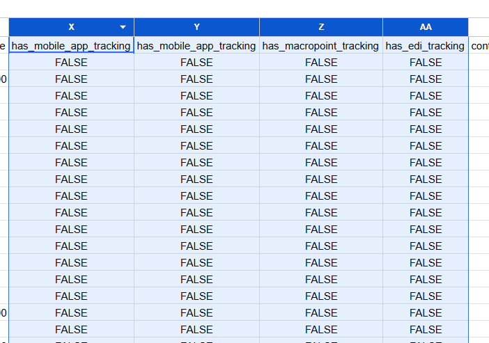
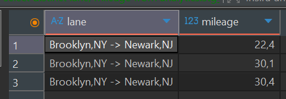
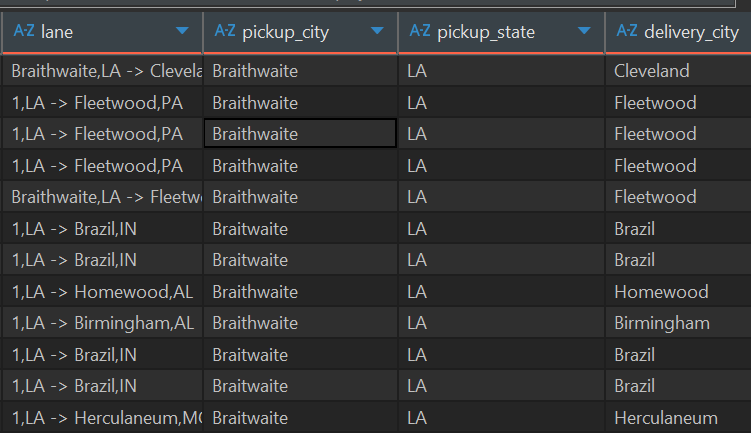

# Data Quality Investigation Report

## Overview
This document describes data quality issues found in the raw CSV data and how they were handled during transformations.

---

### Issue 1: Format in lane Column
**Location:** `raw.loads_raw`, column `lane`
**Description:** Lane format is "City1,ST -> City2,ST" which makes geographic analysis difficult without parsing

**Solution:**
- Parse in `stg_loads.sql` using `split_part()` and `trim()`
- Extract pickup_city, pickup_state, delivery_city, delivery_state
- Created `dim_location` to normalize locations

**Code:**
```sql
trim(split_part(split_part(lane, '->', 1), ',', 1)) as pickup_city,
trim(split_part(split_part(lane, '->', 1), ',', 2)) as pickup_state,    
trim(split_part(split_part(lane, '->', 2), ',', 1)) as delivery_city,
trim(split_part(split_part(lane, '->', 2), ',', 2)) as delivery_state
```

---

### Issue 2: Duplicate Records but with the same id
**Location:** `raw.loads_raw`
**Description:** Same loadsmart_id appearing multiple times with identical attributes

**Solution:**
- Deduplication in `stg_loads.sql` using `row_number()` window function
- Keep only the first occurrence per unique combination of load attributes
- Validate uniqueness with test on `loadsmart_id`

**Code:**
```sql
select 
  *,
  row_number() over (
    partition by 
      quote_date,
      book_date,
      source_date,
      pickup_date,
      delivery_date,
      pickup_appointment_time,
      delivery_appointment_time,
      lane,
      equipment_type,
      sourcing_channel,
      carrier_name,
      shipper_name,
      book_price,
      source_price,
      pnl,
      mileage,
      carrier_rating,
      carrier_dropped_us_count,
      carrier_on_time_to_pickup,
      carrier_on_time_to_delivery,
      carrier_on_time_overall,
      load_booked_autonomously,
      load_sourced_autonomously,
      load_was_cancelled
    order by loadsmart_id
  ) as rn
where rn = 1
```

**Test:**
```yaml
- unique:
    column_name: loadsmart_id
```

---

### Issue 3: All FALSE Values in Tracking Columns


**Location:** `raw.loads_raw`, columns `has_mobile_app_tracking`, `has_macropoint_tracking`, `has_edi_tracking`
**Description:** All records have FALSE value in tracking-related columns (note: `has_mobile_app_tracking` appears duplicated in raw data)

**Impact:** These columns would be useful for carrier dimension analysis, but with all values being FALSE, it appears to be a data collection issue rather than actual business reality

**Solution:**
- Identified issue but **excluded from marts** due to data quality concerns
- I would verify with data source before including in analytics

---

### Issue 4: Missing Street Address in Lane Data


**Location:** `raw.loads_raw`, column `lane`
**Description:** Lane contains only "City, ST -> City, ST" format, missing street addresses for pickup and delivery locations

**Impact:** 
- Cannot create fully granular `dim_lane` with street-level details
- Mileage varies significantly for same lane (different pickup/delivery addresses within same city)
- Cannot analyze if drivers took exact same route or if variance is due to different addresses


**Solution:**
- Kept `mileage` in `fact_loads` instead of `dim_lane`
- Each load retains its actual mileage value
- Dimension normalized only on City/State level

**Recommendation:**
Future enhancements would require street-level location data to:
1. Identify exact pickup/delivery addresses
2. Create more granular lane dimensions
3. Perform route efficiency analysis
4. Detect routing anomalies

---

### Issue 5: Numeric Characters in City Names
**Location:** `raw.loads_raw`, column `lane`
**Description:** Some lanes have numeric characters instead of city names (e.g., "1,LA -> Herculaneum,MO")

**Root Cause:** Incomplete data in source.

**Solution Implemented:**
- Created `clean_city_name()` macro in `macros/clean_city_name.sql`
- Macro performs intelligent city name resolution:
  1. First: Search for clean city name in other loads with same state pair
  2. Second: Search for clean city name from **same shipper** in same state
  3. Fallback: Use state abbreviation (e.g., "1,LA" → "LA")

**Code in stg_loads.sql:**
```sql
{{ clean_city_name('pickup_city_raw', 'pickup_state', 'delivery_state') }} as pickup_city,
{{ clean_city_name('delivery_city_raw', 'delivery_state', 'pickup_state') }} as delivery_city,
```


**Test:**
- tests/assert_no_numeric_city_name.sql
- Validates that no numeric characters remain in city names after cleaning

---