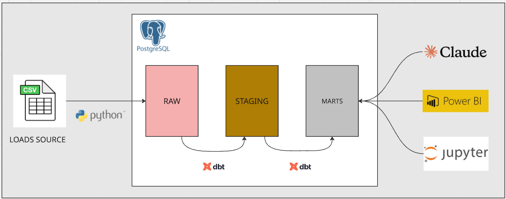
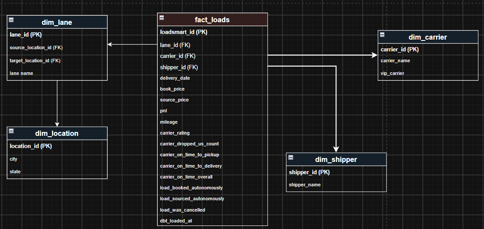

# analytics-engineer-challenge

## Solution Overview

| # | Solution | Where |
|---|----------|-------|
| 1 | dbt project | [`elt/transformations/`](elt/transformations) |
| 2 | AI notebook (text-to-SQL semantic agent) | [`agent/`](agent) |
| 3 | Export data notebook | [`export_notebook/`](export_notebook) |
| 4 | How to run everything | [Setup Instructions](#setup-instructions) below |
| 5 | Data quality | [`DATA_QUALITY_INVESTIGATION.md`](DATA_QUALITY_INVESTIGATION.md) |
| 6 | Report (Power BI) | [`visualization/`](visualization) |

Each linked folder above has its own README with more detail.

## Solution Workflow Diagram


## Dimensional Modeling


## Prerequisites

- **OS:** Linux or macOS. On Windows, use **WSL2** — the setup below assumes a Unix-like shell.
- Python 3.12+
- Docker & Docker Compose
- Git

## Setup Instructions

### 1. Clone the Repository

```bash
git clone https://github.com/lorenzocoracini/analytics-engineer-challenge.git
cd analytics-engineer-challenge
```

### 2. Start PostgreSQL with Docker

```bash
docker-compose up -d
```

### 3. Create Python Virtual Environment

```bash
python3 -m venv .venv
source .venv/bin/activate
```

### 4. Install Dependencies

```bash
pip install -r requirements.txt
```

### 5. Configure Environment Variables

Create `.env` file based on the template:

```bash
cp .env.example .env
```

Edit `.env` with your credentials.

### 6. Setup dbt Profile

```bash
mkdir -p ~/.dbt && cat > ~/.dbt/profiles.yml << 'EOF'
loadsmart:
  outputs:
    dev:
      type: postgres
      host: "{{ env_var('DB_HOST') }}"
      user: "{{ env_var('DB_USER') }}"
      password: "{{ env_var('DB_PASSWORD') }}"
      port: "{{ env_var('DB_PORT') | int }}"
      dbname: "{{ env_var('DB_NAME') }}"
      schema: "{{ env_var('DB_SCHEMA') }}"
      threads: 4
      keepalives_idle: 0
  target: dev
EOF
```

### 7. Load Raw Data

Run the data loading script to populate the `raw.loads_raw` table in PostgreSQL:

```bash
python3 elt/load/load_data.py
```

### 8. Navigate to dbt Project

```bash
cd elt/transformations
```

### 9. Install dbt Dependencies
```bash
dbt deps
```

### 10. Run dbt Models

```bash
dbt run
```

### 11. Notebooks

To run the notebooks (`agent/questions/ask_questions.ipynb`, `export_notebook/export_loads.ipynb`), select the `.venv` interpreter as the Jupyter kernel (VS Code: *Select Kernel* → `.venv/bin/python`), otherwise dependencies like `python-dotenv` won't be found.
