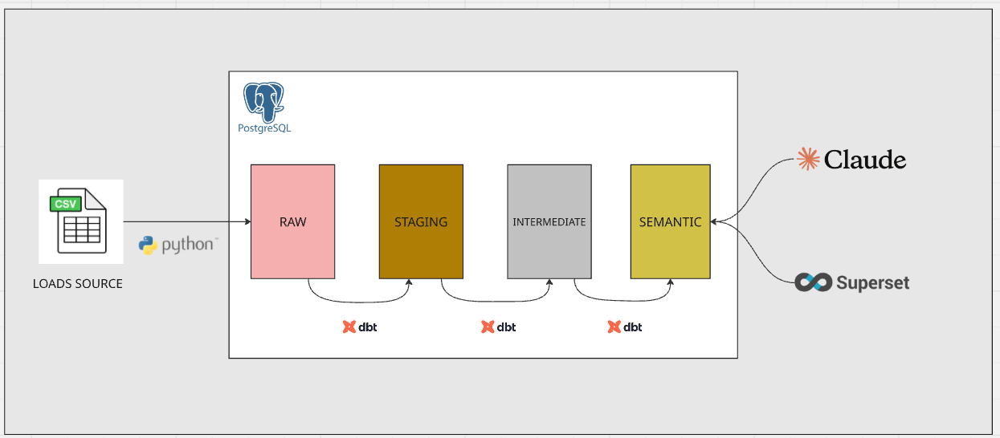
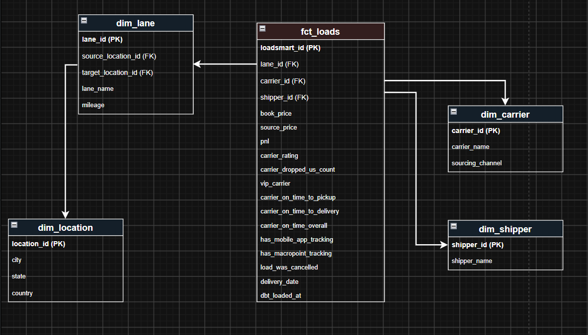

# analytics-engineer-challenge

## Solution Workflow Diagram


## Dimensional Modeling


## Prerequisites

- Python 3.12+
- Docker & Docker Compose
- Git

## Setup Instructions

### 1. Clone the Repository

```bash
git clone https://github.com/lorenzocoracini/analytics-engineer-challenge.git
cd analytics-engineer-challenge
```

### 2. Start PostgreSQL with Docker

```bash
docker-compose up -d
```

### 3. Create Python Virtual Environment

```bash
python3 -m venv .venv
source .venv/bin/activate  # On Windows: .venv\Scripts\activate
```

### 4. Install Dependencies

```bash
pip install -r requirements.txt --break-system-packages
```

### 5. Configure Environment Variables

Create `.env` file based on the template:

```bash
cp .env.example .env
```

Edit `.env` with your credentials.

### 6. Setup dbt Profile

```bash
mkdir -p ~/.dbt && cat > ~/.dbt/profiles.yml << 'EOF'
loadsmart:
  outputs:
    dev:
      type: postgres
      host: "{{ env_var('DB_HOST') }}"
      user: "{{ env_var('DB_USER') }}"
      password: "{{ env_var('DB_PASSWORD') }}"
      port: "{{ env_var('DB_PORT') | int }}"
      dbname: "{{ env_var('DB_NAME') }}"
      schema: "{{ env_var('DB_SCHEMA') }}"
      threads: 4
      keepalives_idle: 0
  target: dev
EOF
```

### 7. Load Raw Data

Place your CSV file in the `elt/data/2026_data_challenge_ae_data.csv` folder, then run:

```bash
python3 elt/load/load_data.py
```

This creates the `raw.loads_raw` table in PostgreSQL.

### 8. Navigate to dbt Project

```bash
cd elt/transformations/dbt_loads
```

### 9. Install dbt Dependencies
```bash
dbt deps
```


### 10. Run dbt Models

```bash
dbt run
```


### 11. Run Data Quality Tests

```bash
dbt test
```
