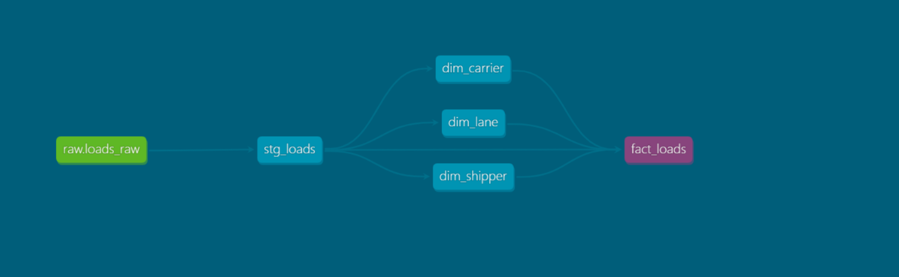
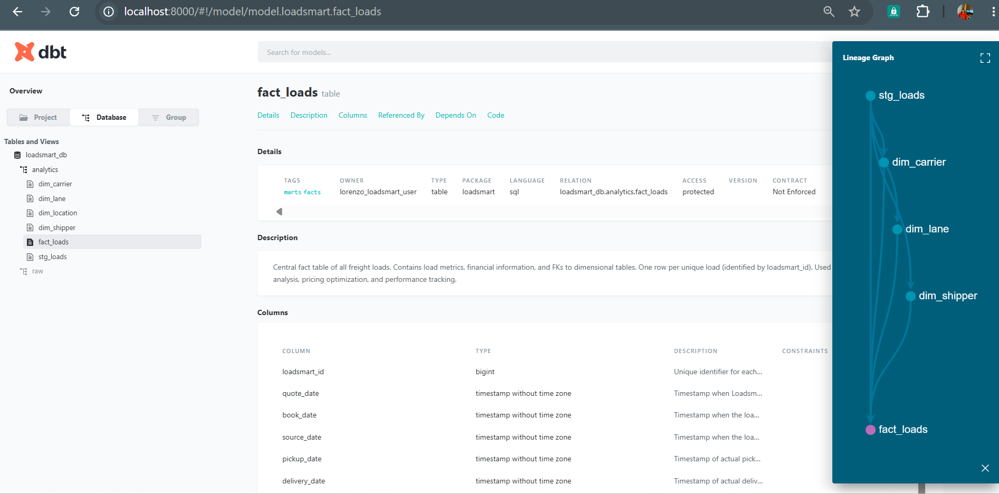
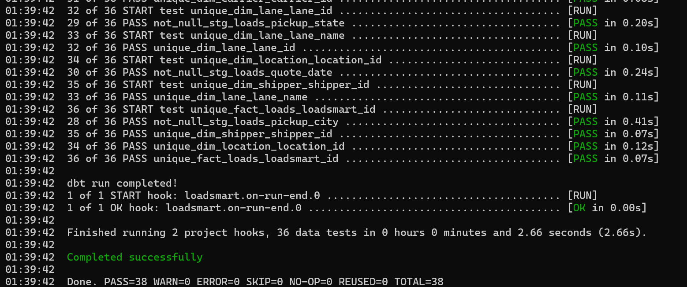

# Transformations (dbt)

dbt project that transforms the raw Loadsmart loads data into the `analytics` marts consumed by the [visualization](../../visualization) dashboard and the [agent](../../agent).

## Project Structure

```
transformations/
├── models/
│   ├── staging/     # 1:1 views over raw sources, light cleanup/typing (stg_loads)
│   └── marts/       # star schema tables: fact_loads + dim_carrier, dim_lane, dim_location, dim_shipper
├── macros/          # reusable Jinja/SQL clean_city_name.sql
├── tests/            # custom data test(beyond schema.yml generic tests)
├── dbt_project.yml   # project config (materializations, paths)
└── packages.yml      # dbt package dependencies (dbt_utils)
```

Sources are declared in [`models/staging/sources.yml`](models/staging/sources.yml) (`raw.loads_raw`). Each model layer has a `schema.yml` with column descriptions and tests (`unique`, `not_null`, etc).

## Flow

`raw.loads_raw` → `stg_loads` (staging) → `fact_loads` + dimensions (marts)



## Docs & Tests

Model docs (descriptions, columns, lineage) are generated with `dbt docs generate` and browsed with `dbt docs serve --port 8000` (opens at `localhost:8000`):



Data quality is checked with `dbt test` (schema tests + the custom test in `tests/`):



## Commands

```bash
dbt run            # build staging views and marts tables
dbt test           # run schema + custom data tests
dbt docs generate            # build docs site
dbt docs serve --port 8000   # browse docs/lineage at localhost:8000
```
