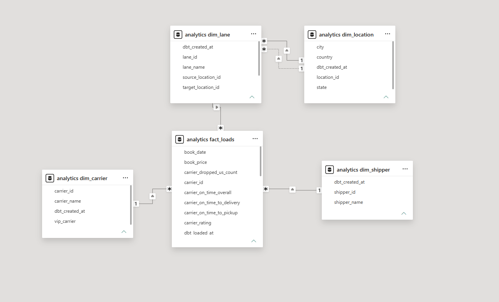
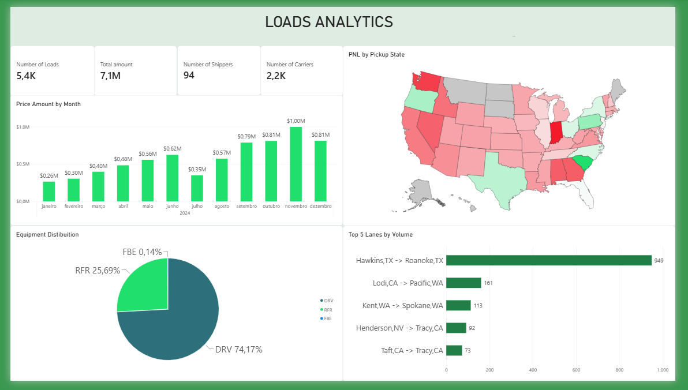

# Visualization

Power BI dashboard built on top of the `analytics` marts (`fact_loads` and its dimensions).

## File

- [`Loadsmart.pbix`](Loadsmart.pbix) — Power BI report file. Open it in Power BI Desktop and point the connection at your local `analytics` schema to explore the data interactively.

## Data Model

## Dashboard

